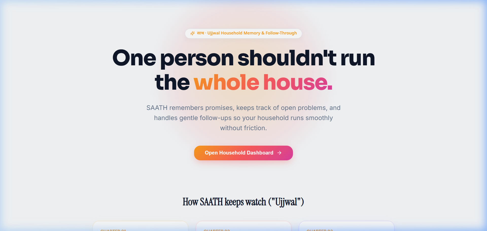
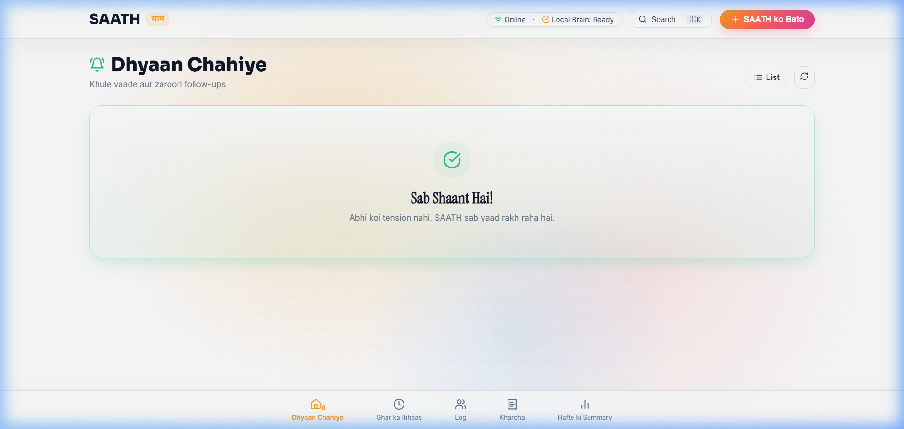
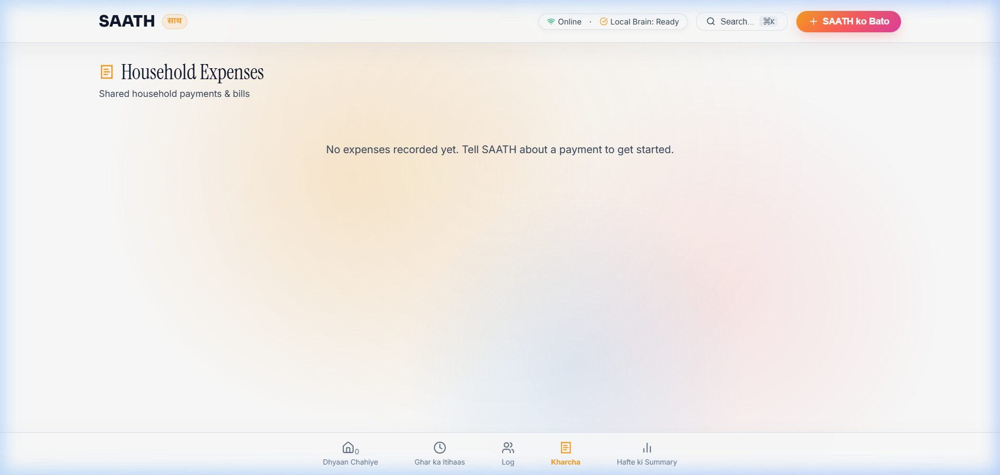
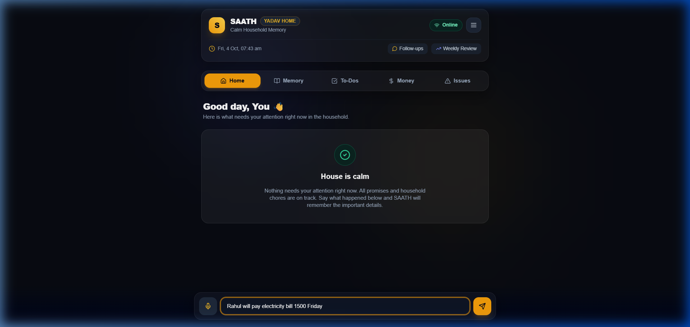
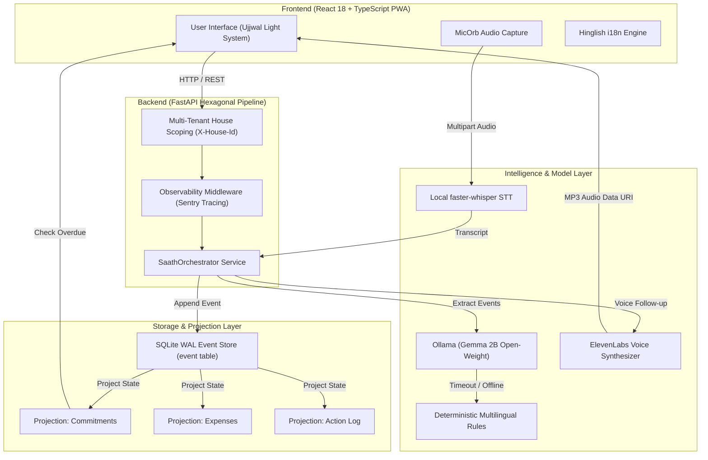

<div align="center">

# SAATH (साथ)
### Local-First Household Memory & Gentle Follow-Through System

*"SAATH remembers what humans shouldn't have to remember. Every unresolved thing has a clear next action."*

[](https://python.org)
[](https://fastapi.tiangolo.com)
[](https://react.dev)
[](https://typescriptlang.org)
[](https://sqlite.org)
[](https://ollama.com)
[](https://elevenlabs.io)
[](https://sentry.io)
[](https://pytest.org)

[📖 Read the Case Study](https://dev.to) · [📺 Watch Demo Video](https://github.com/ramakrishnanyadav/Saathi) · [🚀 Jump to Quickstart](#-quickstart--3-minutes)

---

</div>

## 📖 The Human Story: The Night Everything Became Someone's Responsibility

At 11:47 PM, the bathroom tap is still leaking.

The landlord said the plumber would come tomorrow.  
Rahul has already paid the ₹1,450 electricity bill.  
Someone still owes him their share.  
The milk in the fridge is finished.  

And somewhere in the middle of all this, someone calls out from the hallway:

> *"Bhai, us plumber ko kal ek baar follow up kar dena."*  
> *(Brother, just follow up with that plumber tomorrow.)*

That is the real problem. Not the leaking tap. Not the ₹1,450 bill. **The problem is that someone has to remember all of it.**

In every shared flat or family home, one person quietly inherits the invisible mental load. They become the home's unofficial project manager: chasing landlords, tracking bill splits, and remembering spoken promises made at midnight.

I built **SAATH (साथ)** for my flatmate and close friend, **Rahul**, to eliminate this mental burden.

---

## 📸 Interactive Visual Walkthrough

<div align="center">

### 1. Live Interactive Video Walkthrough
*Watch SAATH process Hinglish commitments, advance time by 48 hours, and split expenses automatically.*


---

### 2. Main Dashboard & Needs Attention View
*Real-time breakdown of overdue promises, waiting commitments, and depleted home supplies.*



---

### 3. Overdue Commitment Detection & WhatsApp Handoff
*When 48 hours elapse, status switches to OVERDUE and generates a 1-click polite WhatsApp draft.*



---

### 4. Human-Gated Financial Confirmation Card
*Money events never auto-apply. Confirmed payments use integer paise and Hare-Niemeyer quota allocation.*



---

### 3. Voice Input & Audio Synthesis
*Audio-reactive mic orb for local Hinglish speech ingestion, paired with ElevenLabs spoken check-ins.*



</div>

---

## 🏛️ System Architecture

SAATH uses a **Hexagonal Architecture (Ports & Adapters)** with strict separation between local AI intelligence, domain logic, safety validation, and append-only event sourcing persistence.



---

## 🌟 Key Engineering Innovations

### 1. Human-Gated Financial Invariants (Integer Paise Math)
SAATH **never** allows an LLM to mutate financial ledgers automatically. 
- All amounts are stored strictly as **integer paise** (₹1,450 = 145,000 paise).
- Expense splits use the **Hare-Niemeyer quota allocation algorithm** (`domain/money.py`), guaranteeing zero loss to floating-point rounding drift.
- Expenses strictly require explicit human button approval (**Human Confirmation Card**).

### 2. Dual Intelligence Engine (Gemma 2B + Rules Fallback)
- **Primary Parser**: Google DeepMind's **Gemma 2B** (`gemma2:2b`) via local Ollama inference.
- **Graceful Fallback**: If Ollama is offline or times out (`SAATH_LLM_TIMEOUT_S`), SAATH degrades seamlessly to an instant multilingual rule parser with **100% fallback reliability**.

### 3. ElevenLabs Gentle Voice Check-Ins
When a commitment is overdue, flatmates can generate spoken voice follow-ups via `ElevenLabsTTSAdapter` (`eleven_multilingual_v2`), replacing awkward text messages with warm spoken voice reminders.

### 4. Sentry Agent Tracing Telemetry
Integrated `sentry-sdk` into `ObservabilityMiddleware`. Every request emits custom telemetry headers (`X-SAATH-Stage`, `X-SAATH-Duration-Ms`) and monitors P50/P95/P99 latency across ingestion, validation, and projection updates.

### 5. 100% Offline & Private PWA
Uses self-hosted `@fontsource/*` packages with **zero external CDN calls**. All voice audio, flatmate expenses, and landlord notes stay on the local home network.

---

## 🚀 Quickstart (< 3 Minutes)

### Prerequisites
- Python 3.11+
- Node.js 18+
- (Optional) [Ollama](https://ollama.com) with `gemma2:2b` installed

### 1. Backend Setup
```bash
# Clone the repository
git clone https://github.com/ramakrishnanyadav/Saathi.git
cd Saathi

# Setup Python virtual environment
python -m venv .venv
source .venv/bin/activate  # On Windows: .venv\Scripts\activate

# Install dependencies
pip install -r requirements.txt

# Start FastAPI server
PYTHONPATH=api python -m uvicorn saath.api.main:app --reload --port 8000
```

### 2. Frontend Setup
```bash
# In a new terminal window
cd web
npm install
npm run dev
```
Open **[http://localhost:5173](http://localhost:5173)** in your browser.

---

## 🧪 Automated Test Suite & Empirical Benchmarks

Run the complete 131-test automated test suite:
```bash
python -m pytest tests/ -v
```

### Evaluation Benchmark Summary (`python -m evals.evaluate_llm`)

| Dataset | Parser Mode | Event Type Accuracy | Money Exactness | Prompt Injection Block Rate | P50 Latency (ms) |
|---|---|---|---|---|---|
| **Golden Set (Regression)** | Rules Engine | **100.0%** | **100.0%** | **100.0%** | **0.01 ms** |
| **Golden Set (Regression)** | Gemma 2B (`gemma2:2b`) | 26.7% | 66.7% | **100.0%** | 2,534.99 ms |
| **Held-Out Set v1** | Rules Engine | **56.0%** | **87.5%** | **100.0%** | **0.01 ms** |

> **Note on LLM Benchmark Transparency**: We report the 26.7% raw LLM extraction accuracy to demonstrate why SAATH's architecture surrounds the LLM with deterministic validation, human confirmation gates, and fallback rules.

---

## 📄 Architecture Decision Records (ADRs)

- [ADR 0001: Append-Only Event Sourcing](docs/adr/0001-event-sourcing.md)
- [ADR 0002: Derived Overdue State Machine](docs/adr/0002-derived-overdue.md)
- [ADR 0003: Integer Paise Representation & Hare-Niemeyer Split](docs/adr/0003-paise-money.md)
- [ADR 0004: Hexagonal Layout Architecture](docs/adr/0004-hexagonal-layout.md)
- [ADR 0005: Model-Output Allow-Listing & Safety Guardrails](docs/adr/0005-model-output-allow-listing.md)
- [Threat Model & Security Boundary](docs/threat-model.md)

---

## 📄 License

Distributed under the **MIT License**. See `LICENSE` for more information.

*Built with ❤️ for Rahul and flatmates everywhere.*
